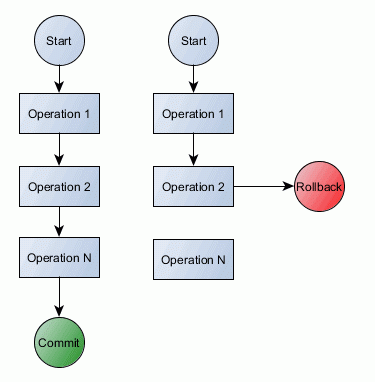

# ACID 
## Полезные ссылки

[Multiversion concurrency control](https://en.wikipedia.org/wiki/Multiversion_concurrency_control)

[Руководство для начинающих: ACID и транзакции БД](http://akorsa.ru/2016/08/rukovodstvo-dlya-nachinayushhih-acid-i-tranzaktsii-bd/)

[Разбираем ACID по буквам в NoSQL](https://habr.com/ru/post/228327/)

[SQL запросы. Четыре свойства транзакций в базах данных. Требования ACID в SQL.](https://www.youtube.com/watch?v=ze6rkueiMfY)

[SQL — Транзакции](https://webformyself.com/sql-tranzakcii/)

[Принципы работы СУБД. MVCC](https://habr.com/ru/post/208400/)

[SQL SERVER – ACID](https://blog.sqlauthority.com/2007/12/09/sql-server-acid-atomicity-consistency-isolation-durability/)

[Уровни изоляции](https://professorweb.ru/my/sql-server/2012/level3/3_16.php)

[Уровни изоляции транзакций](https://docs.microsoft.com/ru-ru/sql/odbc/reference/develop-app/transaction-isolation-levels?view=sql-server-2017)

## Транзакции

Транзакции — это группа операций на чтение/запись, выполняющихся только если все операции из группы успешно выполнены.

По сути транзакции характеризуются следующими четырьмя свойствами (также известными как ACID):

- Атомарность
- Консистентность
- Изоляция
- Долговечность

## «A» Атомарность

> Атомарность гарантирует, что никакая транзакция не будет зафиксирована в системе частично. Будут либо выполнены все её подоперации, либо не выполнено ни одной

Атомарность позволяет объединить единые и независимые операции в «единицу работы», которая работает по принципу «все-или-ничего», успешно выполняющаяся только если все содержащиеся операции успешно выполнятся.

Транзакция может инкапсулировать изменение состояний. Транзакция должна всегда оставлять систему в консистентном состоянии, независимо от того сколько параллельных транзакций выполняются в любой промежуток времени.

## «C» Консистентность

> Транзакция достигающая своего нормального завершения и, тем самым, фиксирующая свои результаты, сохраняет согласованность базы данных. Учитывая специфику NoSQL к распределению информации по серверам — это означает — все ли реплики, содержащие копию данных всегда содержат одну и туже версию данных

Консистентность означает что все требования уникальности были соблюдены для каждой совершенной транзакции. Это подразумевает, что требования по всем ключам (primary и foreign key), типам данных, триггерам успешно пройдены и не было найдено нарушений требования уникальности.

## «I» Изолированность

> Во время выполнения транзакции параллельные транзакции не должны оказывать влияние на её результат. Здесь так же имеет значение понятие уровней изолированности транзакции

Во время выполнения транзакции параллельные транзакции не должны оказывать влияние на её результат. Изоляция дает нам преимущество сокрытия нефинальных изменений состояния от внешнего мира, и так же неуспешные транзакции не должны никогда порушить состояние системы. Изоляция достигается через управление параллельным выполнением операций используя пессимистический или оптимистический механизм блокировки.

## «D» Надёжность

> Независимо от проблем на нижних уровнях (к примеру, обесточивание системы или сбои в оборудовании) изменения, сделанные успешно завершённой       транзакцией, должны остаться сохранёнными после возвращения системы в работу. Другими словами, если пользователь получил подтверждение от системы, что транзакция выполнена, он может быть уверен, что сделанные им изменения не будут отменены из-за какого-либо сбоя.

Успешная транзакция должна всегда изменять состояние системы и прежде чем закончить ее изменения состояния сохраняются в лог транзакций. Если Ваша система внезапно выключится или возникнет перебой с электричеством, тогда все незавершенные транзакции можно воспроизвести.

Для систем сообщений, как JMS, транзакции не являются обязательными. Именно по этой причине в спецификации есть режимы подтверждения вне транзакций.

Операции с файловой системой обычно не контролируются, но если бизнес-требования требуют транзакций для операций с файлами, Вы можете использовать инструмент, такой как  XADisk.

В то время как для файловых систем и систем передачи сообщений использование транзакций опционально, то для БД контроль за транзакциями обязателен.

## Уровни изолированности

Хотя некоторые СУБД предлагают MVCC, обычно управление параллельным выполнением операций достигается через блокировку. Но, как мы знаем, блокировка увеличивает долю сериализации выполняемого кода, влияя на параллелизацию.

Стандарты SQL определяют 4 уровня изолированности:

- READ_UNCOMMITTED
- READ_COMMITTED
- REPEATABLE_READ
- SERIALIZABLE

## Уровень изоляции read uncommitted

Транзакции не изолированы друг от друга. Если СУБД это поддерживает другие уровни изоляции транзакций, он игнорирует любой механизм, который используется для реализации этих уровней. Чтобы они не влияют на отрицательно других транзакций, транзакции, выполняемые на уровне Read Uncommitted, обычно доступный только для чтения.

## Уровень изоляции read committed

Транзакция ожидает, пока не разблокируются строк заблокирован для записи других транзакций; Это предотвращает его чтение данные «грязный».

Содержит транзакции, блокировку чтения (если только он считывает строку) или записи блокировки на текущей строке, для предотвращения другими транзакциями на обновление или удаление его (если он обновляет или удаляет строку). Транзакция освобождает блокировки чтения, когда она перемещается за пределы текущей строки. Он удерживает блокировку записи, до фиксации или отката.

## Уровень изоляции repeatable read

Транзакция ожидает, пока не разблокируются строк заблокирован для записи других транзакций; Это предотвращает его чтение данные «грязный».

Транзакция удерживает блокировки чтения всех строк, он возвращает блокировки приложения и записи для всех строк, его операций вставки, обновления или удаления. Например, если транзакция содержит инструкцию SQL, ВЫБЕРИТЕ * заказы из, блокировки транзакций, чтения строк, как приложение извлекает их. Если транзакция содержит инструкцию SQL, удалить из заказов ГДЕ состояние = «ЗАКРЫТО» , блокировки транзакций, запись строк как удаляет их.

Так как другие транзакции не удается обновить или удалить эти строки, текущая транзакция позволяет избежать любой неповторяющееся чтение. Транзакция освобождает свои блокировки, когда он фиксируется или откатывается назад.

## Упорядочиваемый уровень изоляции

Транзакция ожидает, пока не разблокируются строк заблокирован для записи других транзакций; Это предотвращает его чтение данные «грязный».

Транзакция удерживает блокировку чтения (если только он считывает строки) или блокировку записи (если его можно обновить или удалить строки) на диапазон строк влияет на. Например, если транзакция содержит инструкцию SQL, ВЫБЕРИТЕ * заказы из, диапазон — от всего таблицы Orders; транзакция чтения блокировки таблицы и не допускает новых строк для вставки в него. Если транзакция содержит инструкцию SQL, удалить из заказов ГДЕ состояние = «ЗАКРЫТО» , диапазон — от всех строк с состоянием «ЗАКРЫТО»; блокировки транзакций, записи всех строк в заказы таблицы с состоянием «CLOSED», а не не Разрешить все строки вставлять или обновлять таким образом, чтобы результирующей строке находится в состоянии «ЗАКРЫТО».

Так как другие транзакции не удается обновить или удалить строки в диапазоне, текущая транзакция позволяет избежать любой неповторяющееся чтение. Поскольку другим транзакциям вставлять строки в диапазоне, текущая транзакция позволяет избежать любой фантомы. Транзакция освобождает его блокировки, при фиксации или отката.

Уровни изолированности по умолчанию
Даже если SQL стандарт обязывает использовать уровень изоляции SERIALIZABLE, большинство СУБД используют разный уровень по умолчанию.

- Oracle - READ_COMMITTED
- MySQL - REPEATABLE_READ
- Microsoft SQL Server - READ_COMMITTED
- PostgreSQL - READ_COMMITTED
- DB2 - CURSOR STABILITY

Обычно, READ_COMMITED является правильным выбором, поскольку даже SERIALIZABLE не может защитить Вас от потери обновлений во время выполнения чтения/записей в разных транзакций и веб-реквестов. Вы должны принять во внимание эту информацию при принятии решения об уровне изоляции в требованиях enterprise систем.