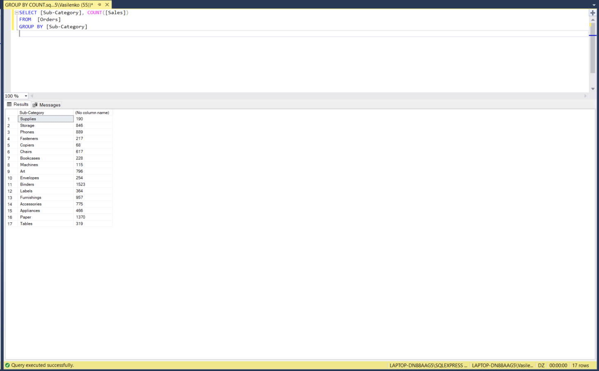
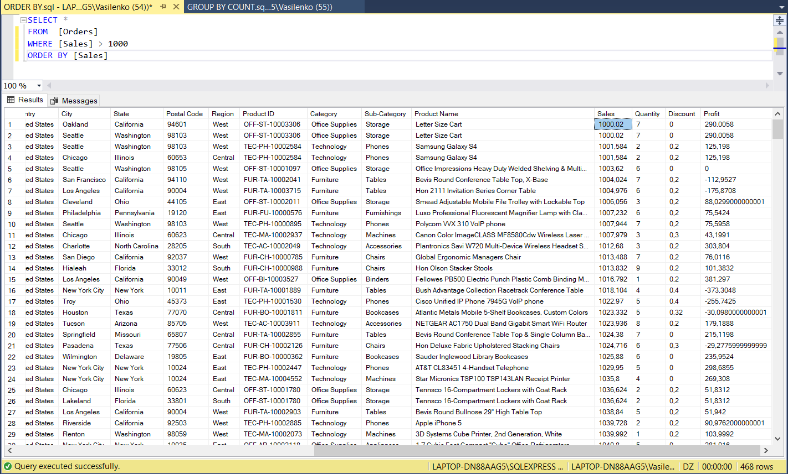
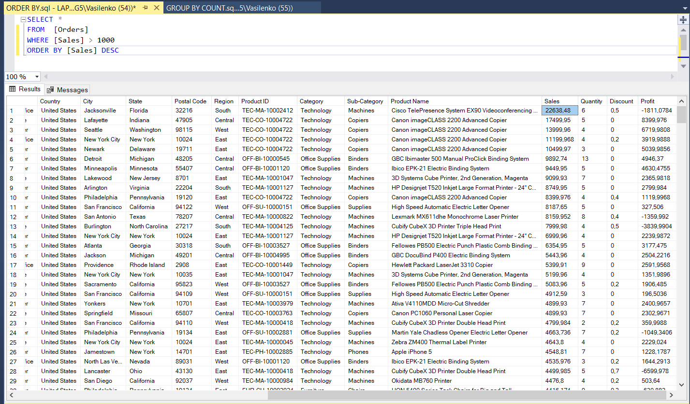

# Group By, Order By, Having By 


## Полезные ссылки
[SELECT — предложение ORDER BY](https://docs.microsoft.com/ru-ru/sql/t-sql/queries/select-order-by-clause-transact-sql?view=sql-server-2017)

[Команда ORDER BY](http://code.mu/sql/order-by.html)

[SELECT — GROUP BY](https://docs.microsoft.com/ru-ru/sql/t-sql/queries/select-group-by-transact-sql?view=sql-server-2017)

[Команда GROUP BY](http://code.mu/sql/group-by.html)

[SELECT — HAVING (Transact-SQL)](https://docs.microsoft.com/ru-ru/sql/t-sql/queries/select-having-transact-sql?view=sql-server-2017)

[Команда HAVING](http://code.mu/sql/having.html)


## Group By

GROUP BY используется для определения групп выходных строк, к которым могут применяться агрегатные функции (COUNT, MIN, MAX, AVG и SUM).

Синтаксис:
- Select агрегатные функции
- From источник
- Where Условия отбора
- Group by поля группировки
- Having Условия по агрегатным функциям
- Order by поля сортировки

### Агрегатные функции ###

Агрегатные функции (англ. aggregate function) — это математические функции, применяемые к набору входных данных и возвращающие по ним одно результирующее значение.

Агрегатные функции используются для обобщения данных в языках программирования (включая языки управления данными в СУБД), электронных таблицах и реляционной алгебе. К числу агрегатных функций относят, например, следующие функции:

- SUM (сумма)
- MAX(максимальное значение)
- MIN (минимальное значение)
- COUNT (количество значений)
- AVG (среднее значение, обычно среднее арифметическое)
- MODE (мода)
- MEDIAN (медиана)

## Пример 

```sql

SELECT [Sub-Category], COUNT([Sales]) FROM  [Orders] GROUP BY [Sub-Category]

```



```sql

SELECT [Sub-Category], SUM([Sales]) AS sum FROM  [Orders] GROUP BY [Sub-Category]

```


## Order By

Команда ORDER BY позволяет сортировать записи по определенному полю при выборе из базы данных.

Сортировка по одному полю:

```sql

SELECT * FROM имя_таблицы WHERE условие ORDER BY поле_для_сортировки

SELECT * FROM имя_таблицы WHERE условие ORDER BY поле1, поле2...

```

### ASC | DESC ###

Указывает порядок сортировки значений в указанном столбце — по возрастанию или по убыванию. Значение ASC сортирует от низких значений к высоким. Значение DESC сортирует от высоких значений к низким. Порядок сортировки по умолчанию — ASC. Значения NULL рассматриваются как минимально возможные значения.

```sql

SELECT * FROM имя_таблицы WHERE условие ORDER BY поле ASC

SELECT * FROM имя_таблицы WHERE условие ORDER BY поле DESC

```

Условие where не обязательно - если его не поставить, будут выбраны все записи:


```sql

SELECT * FROM имя_таблицы ORDER BY поле

```

## Пример 

```sql

SELECT * FROM  [Orders] WHERE [Sales] > 1000 ORDER BY [Sales]

SELECT * FROM  [Orders] WHERE [Sales] > 1000 ORDER BY [Sales] ASC

```



```sql

SELECT * FROM  [Orders] WHERE [Sales] > 1000 ORDER BY [Sales] DESC

```



## HAVING

Команда HAVING позволяет фильтровать результат группировки, сделанной с помощью команды group by.

Оператор HAVING определяет, какие группы будут включены в выходной результат, то есть выполняет фильтрацию групп.

> Применение HAVING во многом аналогично применению WHERE. Только есть WHERE применяется к фильтрации строк, то HAVING используется для фильтрации групп.

```sql

SELECT [Sub-Category], COUNT(*) AS [count] FROM  [Orders] GROUP BY [Sub-Category] 

```


```sql

SELECT [Sub-Category], COUNT(*) AS [count] FROM  [Orders] GROUP BY [Sub-Category] HAVING COUNT(*)<=500

```

