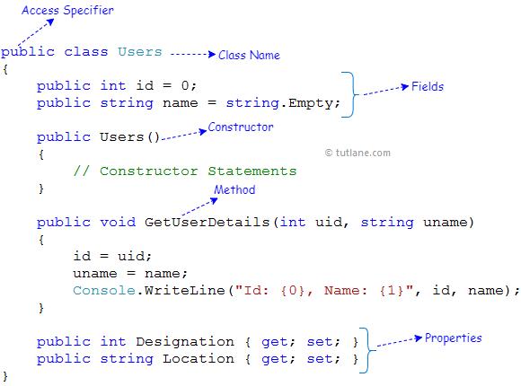

#What is the difference between class and object?

## Полезные ссылки
[C# | Class and Object](https://www.geeksforgeeks.org/c-sharp-class-and-object/)

[C# Class & Object Tutorial with Examples](https://www.guru99.com/c-sharp-class-object.html)

[Class And Object In C#](https://www.c-sharpcorner.com/blogs/class-and-object-in-c-sharp)

[Классы и объекты](https://metanit.com/sharp/tutorial/3.1.php)

[Difference between class and object](http://net-informations.com/faq/oops/classobject.htm)

[C# Classes and Objects with Examples](https://www.tutlane.com/tutorial/csharp/csharp-classes-and-objects-with-examples)


## Class and Object 

***Class and Object*** - это основные концепции объектно-ориентированного программирования, которые вращаются вокруг реальных объектов. ***Class*** - это пользовательский проект или прототип, из которого создаются объекты. По сути, класс объединяет поля и методы (функция-член, которая определяет действия) в один модуль. В ***C#*** классы поддерживают полиморфизм, наследование, а также предоставляют концепцию производных классов и базовых классов.

```csharp 
public class Users
{
    public int id = 0;
    public string name = string.Empty;
    public Users()
    {
        // Constructor Statements
    }

    public void GetUserDetails(int uid, string uname)
    {
        id = uid;
        uname = name;
        Console.WriteLine("Id: {0}, Name: {1}", id, name);
    }

    public int Designation { get; set; }
    public string Location { get; set; }
}
```

Ниже приведено подробное описание различных элементов данных, которые мы использовали в приведенном выше примере класса c#.



Если вы видите изображение выше, мы использовали различные члены данных, такие как  модификаторы доступа,  поля,  свойства,  методы, конструкторы и т. д. В нашем классе c # в соответствии с нашими требованиями.

## Члены класса C#

Как уже говорилось, класс может содержать несколько элементов данных на языке программирования c#. В следующей таблице перечислены различные типы членов данных, которые можно использовать в классах c#.

| член            | Описание |
| ------------- | ------------- |
| Поля | Переменные класса|
| методы | Вычисления и действия, которые могут быть выполнены классом  |
| свойства  | Действия, связанные с чтением и записью именованных свойств класса|
| События | Уведомления, которые могут быть сгенерированы классом  |
|Конструкторы  | Действия, необходимые для инициализации экземпляров класса или самого класса  |
| операторы  |Преобразования и операторы выражений, поддерживаемые классом|
| Константы | Постоянные значения, связанные с классом |
|индексаторы  | Действия, связанные с индексированием экземпляров класса как массива |
| Финализаторы  | Действия, выполняемые до того, как экземпляры класса будут окончательно отброшены |
| Типы  | 	Вложенные типы, объявленные классом |


## Declaration of class
Как правило, объявление класса содержит только ключевое слово class, за которым следует идентификатор ***(имя)*** класса. Но есть некоторые необязательные атрибуты, которые можно использовать с объявлением класса в соответствии с требованиями приложения. В общем, объявления классов могут включать эти компоненты в следующем порядке:

- ***Модификаторы:*** Class может быть открытым или внутренним и т. д. По умолчанию модификатор класса является внутренним.
- ***Ключевое слово Class***: класс используется ключевое слово для объявления класса типа.
- ***Идентификатор class:*** предоставляется переменная типа class. Идентификатор (или имя класса) должен начинаться с начальной буквы, которая должна быть заглавной в соответствии с соглашением.
- ***Базовый класс или Super class:*** имя родителя класса (суперкласса), если таковое имеется, с предшествующим: (двоеточие). Это необязательно.
- ***Interfaces:*** Разделенный запятыми список интерфейсов, реализованных классом, если таковые имеются, с предшествующим: (двоеточие) . Класс может реализовывать более одного интерфейса. Это необязательно.
- ***Тело:*** тело класса окружено {} (фигурные скобки).
Конструкторы в классе используются для инициализации новых объектов. Поля - это переменные, которые предоставляют состояние класса и его объектов, а методы используются для реализации поведения класса и его объектов.


## Object 
В C# Object является экземпляром класса, и его можно использовать для доступа к членам-данным и функциям-членам класса.

## Создание объектов в C#
В общем, мы можем сказать, что объекты являются конкретными сущностями классов. В c # мы можем создавать объекты, используя ключевое слово ***new***, за которым следует имя класса, как показано ниже.

```csharp 

Users user = new Users();

```
Если вы посмотрите на приведенный выше пример, мы создали экземпляр (user) для класса (Users), который мы создали в предыдущем разделе. Теперь экземпляр «пользователь» является ссылкой на объект, основанный на пользователях. Используя имя объекта «пользователь», мы можем получить доступ ко всем элементам данных и функциям-членам класса Users.

## Пример объектов C#

```csharp 

using System;

namespace Tutlane
{
    class Program
    {
        static void Main(string[] args)
        {
            Users user = new Users("Suresh Dasari", 30);
            user.GetUserDetails();
            Console.WriteLine("Press Enter Key to Exit..");
            Console.ReadLine();
        }
    }

    public class Users
    {
        public string Name { get; set; }
        public int Age { get; set; }
        public Users(string name, int age)
        {
            Name = name;
            Age = age;
        }

        public void GetUserDetails()
        {
            Console.WriteLine("Name: {0}, Age: {1}", Name, Age);
        }
    }
}

```

Это базовая единица объектно-ориентированного программирования и представляет реальные сущности. Типичная программа на C # создает много объектов, которые, как вы знаете, взаимодействуют, вызывая методы. Объект состоит из:

- ***State:*** (состояние) представлено атрибутами объекта. Это также отражает свойства объекта.
- ***Behavior*** (поведение) оно представлено методами объекта. Он также отражает реакцию объекта на другие объекты.
- ***Identity*** (идентичность) он дает уникальное имя объекту и позволяет одному объекту взаимодействовать с другими объектами.


|***Class***            | ***Object***  |
| ------------- | ------------- |
|Класс - это проект, из которого вы можете создать экземпляр, то есть объекты.|Объект является экземпляром класса, который помогает программистам использовать переменные и методы внутри класса.|
|Класс используется для связывания данных, а также методов вместе как единое целое.|Объект действует как переменная класса.|
|Классы имеют логическое существование.|Объекты имеют физическое существование.|
|Класс не занимает места в памяти, когда его создает программист.|Объект забирает память, когда ее создает программист.|
|Класс должен быть объявлен только один раз.|Объекты могут быть объявлены несколько раз в зависимости от требования.|


