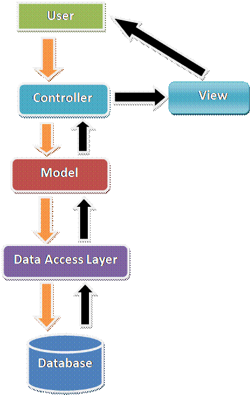

# What is MVC? draw a diagram?

## Полезные ссылки 
[Введение в ASP.NET MVC 5](https://metanit.com/sharp/mvc5/1.1.php)

[Общие сведения ASP.NET Core MVC](https://docs.microsoft.com/ru-ru/aspnet/core/mvc/overview?view=aspnetcore-2.2)

[Сервис-ориентированная архитектура](https://ru.wikipedia.org/wiki/%D0%A1%D0%B5%D1%80%D0%B2%D0%B8%D1%81-%D0%BE%D1%80%D0%B8%D0%B5%D0%BD%D1%82%D0%B8%D1%80%D0%BE%D0%B2%D0%B0%D0%BD%D0%BD%D0%B0%D1%8F_%D0%B0%D1%80%D1%85%D0%B8%D1%82%D0%B5%D0%BA%D1%82%D1%83%D1%80%D0%B0)

[Разделение ответственности](https://ru.wikipedia.org/wiki/%D0%A0%D0%B0%D0%B7%D0%B4%D0%B5%D0%BB%D0%B5%D0%BD%D0%B8%D0%B5_%D0%BE%D1%82%D0%B2%D0%B5%D1%82%D1%81%D1%82%D0%B2%D0%B5%D0%BD%D0%BD%D0%BE%D1%81%D1%82%D0%B8)

[Принцип разделения ответственности и ORM](https://habr.com/ru/post/263027/)

## Что такое ASP.NET MVC

MVC - это архитектурный паттерн. Он разделяет приложение на три основных компонента. Три соединения - это Model, View и Controller. Он обрабатывает конкретные аспекты разработки приложения.

## Model 

Model - это простой класс. Это форма данных. Модель содержит бизнес-логику. **Controller** и **View** могут получить доступ к модели. Модель помогает передавать данные из **Controller** для **View** и просмотра в контроллер. Используя модель, мы отображаем данные на странице просмотра.

## View

View является пользовательским интерфейсом. Он используется для отображения всех данных с использованием модели. Мы используем два вида движков представления. Один - это традиционный механизм просмотра, а другой -  Razor. Традиционный движок представления - это обычная страница «.ASPX».

Razor view engine используется для разработки нормального дизайна страницы с использованием элементов управления HTML Helper. Содержит расширение «.CSHTML». Синтаксис немного отличается в обоих движках представления.

## Controller

Контроллер является сердцем MVC и обрабатывает пользовательский запрос. Это простой класс. Контроллер может получить доступ к модели и передать данные для **View** с помощью модели. Мы можем передавать данные между контроллером и представлением, используя View Data, Temp Data и View Bag. Контроллер является промежуточным между Model  и View.

На следующей схеме показаны три основных компонента и существующие между ними связи.

> Контроллеры не должны быть чересчур сложными из-за слишком большого количества обязанностей. Чтобы не перегружать логику контроллера, перенесите бизнес-логику из контроллера в модель предметной области.

Рабочий процесс MVC начинается с запроса пользователя. На основании запроса сначала идет контроллер, затем идет соответствующий метод действия. В методе действия мы называем все уровни, такие как уровень бизнес-логики и уровень доступа к данным.

Как только мы достигаем метод действия, он переходит на уровень доступа к данным. Иногда при запросе запрос содержит некоторые входные данные, которые связываются с моделью, а затем направляются на уровень доступа к данным.

Запрос достигает уровня доступа к данным, затем отправляется в соответствующую базу данных. Он выбирает данные из базы данных на основе запроса, а затем возвращается в обратный формат. После извлечения данных и привязки в модели они переходят к методу действия.

Метод действия возвращает результат в соответствующее представление с помощью модели. Теперь пользователь получает ответ. Метод действия возвращает результаты в другом формате.

# Преимущества MVC

- Разделение Концерна (SOC) является основным преимуществом. Здесь мы разделяем режим, вид и контроллер.
- Мы можем легко поддерживать приложение MVC.
- Разработка тест-драйва (TDD) - еще одно главное преимущество. Мы можем создать приложение с блоком
- Мы можем написать наш собственный контрольный пример.
- Разделите приложение, и многие разработчики могут работать одновременно, не влияя друг на друга.
- Приложение MVC - это адаптивный по умолчанию веб-сайт и мобильный шаблон.
- Мы можем создать наш собственный движок представления.

## MVC заменяет веб-формы ASP.NET?

Нет, MVC не заменяет веб-формы ASP.NET. Это еще один выбор для разработчиков. Многие компании все еще используют традиционную веб-форму ASP.NET. MVC сейчас используется многими компаниями, и он очень известен. Он основан на мнении клиентов и структуре проекта, используют ли они традиционное приложение ASP.NET или ASP.NET MVC.
