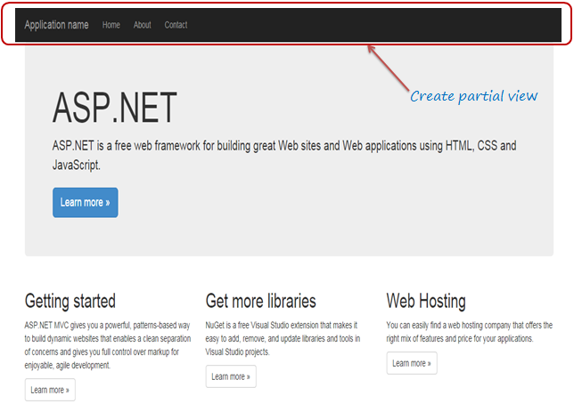

# What is a PartialView? What is PartialView used for?

## Полезные ссылки
[Partial View](https://www.tutorialsteacher.com/mvc/partial-view-in-asp.net-mvc)

[Partial View In MVC](https://www.c-sharpcorner.com/UploadFile/ff2f08/partial-view-in-mvc/)

[Partial Views](https://jakeydocs.readthedocs.io/en/latest/mvc/views/partial.html)

[Partial views in ASP.NET Core](https://docs.microsoft.com/en-us/aspnet/core/mvc/views/partial?view=aspnetcore-2.2)


## Partial View

**Partial View** (***Частичное представление***) в ASP.NET MVC - это специальное представление, которое отображает часть содержимого представления. Это как пользовательский элемент управления веб-формы. Частичное может быть многоразовым в нескольких видах. Это помогает нам уменьшить дублирование кода. Другими словами, частичное представление позволяет нам отображать представление в родительском представлении.содержимого.

## When Should I Use Partial Views?

**Partial View** являются эффективным способом разделения больших представлений на более мелкие компоненты. Они могут уменьшить дублирование содержимого представления и позволяют повторно использовать элементы представления. Общие элементы макета должны быть указаны в _Layout.cshtml . Неиспользуемый повторно используемый контент может быть инкапсулирован в частичные представления.

Если у вас есть сложная страница, состоящая из нескольких логических частей, может быть полезно работать с каждой частью как с частичным представлением. Каждый фрагмент страницы можно просматривать изолированно от остальной части страницы, и представление для самой страницы становится намного проще, поскольку оно содержит только общую структуру страницы и вызывает визуализацию частичных представлений.

Создадим для панели навигации свое частичное представление (**Partial View**) 



***HTML helper***  есть два метода для рендеринга частичного представления: Partial и RenderPartial

```csharp  
<DIV>  
    @ Html.Partial ("PartialViewExample")  
</ DIV>  

<DIV>  
    @ {  
        Html.RenderPartial ("PartialViewExample");  
      }  
</ DIV>  
```

## @ Html.RenderPartial
 
Результат метода **RenderPartial** записывается непосредственно в ответ HTTP, это означает, что этот метод использовал тот же объект **TextWriter**, который использовался в текущем представлении. Этот метод ничего не возвращает.
 
## @ Html.Partial
 
Этот метод отображает представление как строку в кодировке HTML. Мы можем сохранить результат метода в строковой переменной.
 
Метод **Html.RenderPartial** записывает выходные данные непосредственно в поток ответов HTTP, поэтому он немного быстрее, чем метод **Html.Partial**.

```csharp  
public ActionResult PartialViewExample()  
{  
    return PartialView();  
}  
```

## Визуализация частичного представления с использованием jQuery
Иногда нам нужно загрузить частичное представление во всплывающем окне модели во время выполнения, в этом случае мы можем визуализировать частичное представление с помощью метода load элемента JQuery.

```csharp  
<script type="text/jscript">  
        $('#partialView').load('/shared/PartialViewExample’);  
</script> 
```

|**Посмотреть** |**Частичный вид**  |
|----------------|-------------------------------|
|View  содержит страницу макета|Partial view  не содержит страницы макета|
|_viewstart страница отображается перед просмотром |Partial view  не проверяет _viewstart.cshtml. Мы не можем разместить какой-либо общий код для частичного просмотра на странице _viewStart.cshtml.|
|Представление может иметь теги разметки, такие как html, body, head, title, meta и т. д. |Partial view  специально разработано для рендеринга в представлении, и в результате оно не содержит разметки.|

> Partial view более легкий, чем вид. Мы также можем передать обычное представление в метод RenderPartial.

> Если в представлении не указана страница макета, ее можно рассматривать как частичное представление. В бритве нет никакого различия между представлениями и частичными представлениями как в механизме представления ASPX (aspx и ascx).